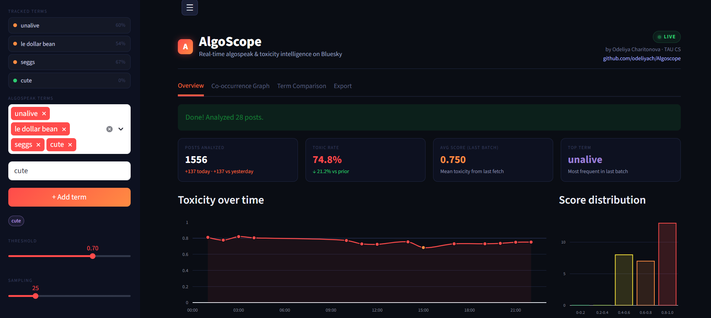
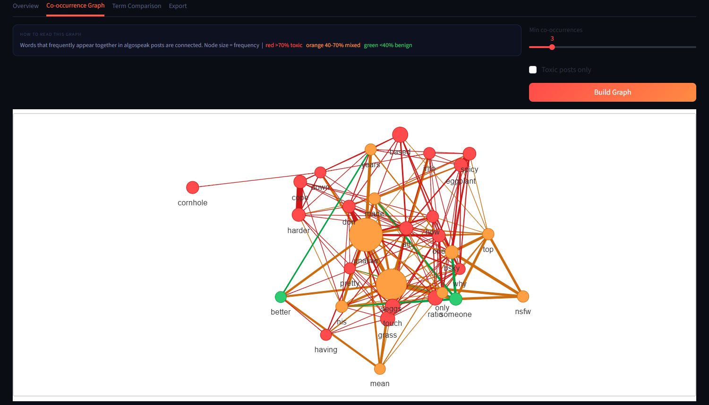
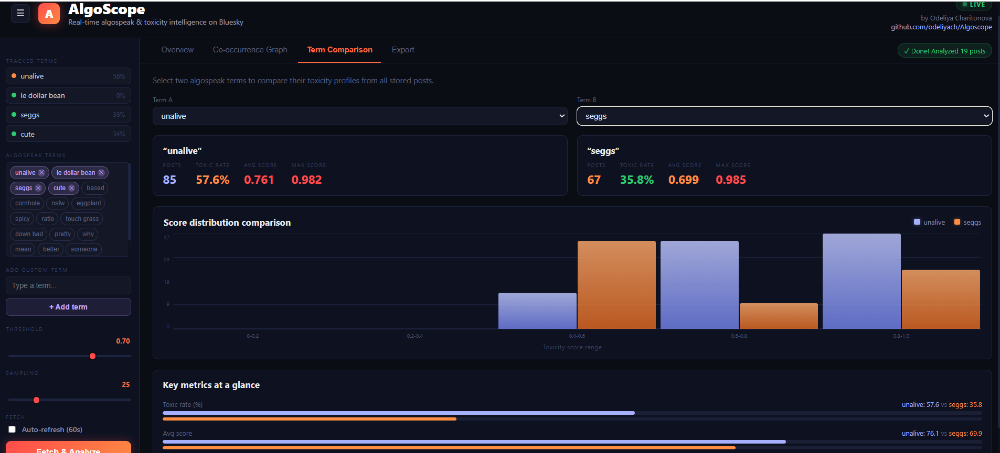

<div align="center">

# 🔍 AlgoScope

**Real-time algospeak & toxicity detection on Bluesky**

<p align="center">
  <a href="https://github.com/odeliyach/Algoscope/actions/workflows/ci.yml"></a>
  <a href="https://codecov.io/gh/odeliyach/Algoscope"></a>
  <a href="https://github.com/odeliyach/Algoscope/actions/workflows/ci.yml"></a>
  <a href="https://python.org"></a>
  <a href="https://huggingface.co/odeliyach/AlgoShield-Algospeak-Detection"></a>
  <a href="https://huggingface.co/spaces/odeliyach/algoscope"></a>
  <a href="https://streamlit.io"></a>
  <a href="LICENSE"></a>
</p>

*Odeliya Charitonova · 2026*

</div>

---
## What is AlgoScope?

Algospeak is the evolving coded language people use to evade content moderation — "unalive" instead of suicide, "seggs" instead of sex, "le dollar bean" instead of lesbian. Standard toxicity APIs score these near zero because they look benign to classifiers trained on explicit language.

AlgoScope is a live dashboard that catches them anyway. It ingests posts from the Bluesky social network in real time, classifies each one with a fine-tuned DistilBERT model trained specifically on algospeak, and visualizes toxicity patterns, co-occurrence networks, and trend spikes in an interactive dashboard.

> **Why this matters:** Algospeak evasion is an active research problem in content moderation. This project turns published NLP research into a live, clickable product.

---

## Live Demo

| Resource | Link |
|----------|------|
| 🖥️ Live dashboard | [odeliyach-algoscope.hf.space](https://odeliyach-algoscope.hf.space) |
| 🤗 Fine-tuned model | [odeliyach/AlgoShield-Algospeak-Detection](https://huggingface.co/odeliyach/AlgoShield-Algospeak-Detection) |
| 💻 GitHub | [github.com/odeliyach/Algoscope](https://github.com/odeliyach/Algoscope) |
| 🗂️ Streamlit version | [`streamlit-legacy` branch](https://github.com/odeliyach/Algoscope/tree/streamlit-legacy) |

---

## Screenshots







---

## Features

- **🚨 Spike alerts** — animated banner when toxicity exceeds threshold in the last batch, with severity level (Elevated / High / Critical)
- **📊 Toxicity over time** — hourly SVG area chart with color-coded data points (green / orange / red by toxicity level)
- **🕸️ Co-occurrence graph** — force-directed canvas simulation built from scratch; nodes colored by toxicity rate, log-scaled by frequency
- **⚖️ Term comparison** — side-by-side toxicity profiles for any two tracked terms
- **📥 Export** — download all analyzed posts as CSV or JSON
- **🎛️ Threshold slider** — tune precision/recall tradeoff at inference time without retraining
- **✨ Animated counters** — metric cards animate on each fetch; splash screen on first load

---

## Architecture

The project has two phases. The ML core (`model.py`, `ingestion.py`, `database.py`, `graph.py`) is unchanged between them.

### Current: React + FastAPI (main branch)

```
┌─────────────────┐   AT Protocol    ┌───────────────────┐
│   Bluesky API   │ ───────────────▶ │   ingestion.py    │
└─────────────────┘                  │  dedup + preproc  │
                                     └─────────┬─────────┘
                                               │
                                     ┌─────────▼─────────┐
                                     │     model.py      │
                                     │  DistilBERT       │
                                     │  singleton + batch│
                                     └─────────┬─────────┘
                                               │
                          ┌────────────────────▼──────────────────────┐
                          │              database.py                  │
                          │   SQLite · URI-keyed deduplication        │
                          └────────────────────┬──────────────────────┘
                                               │
                          ┌────────────────────▼──────────────────────┐
                          │              app/main.py                  │
                          │   FastAPI · REST API + static file server │
                          │   /posts  /fetch-and-analyze              │
                          │   /graph-data  /stats  /health            │
                          └────────────────────┬──────────────────────┘
                                               │  HTTP (same origin)
                          ┌────────────────────▼──────────────────────┐
                          │           frontend/ (React + Vite)        │
                          │   TypeScript · Tailwind · framer-motion   │
                          │   Force-directed graph · SVG charts       │
                          └─────────────────────────────────────────────┘
```

**Stack:** Python 3.12 · FastAPI · uvicorn · React 18 · TypeScript · Vite · Tailwind · SQLite · NetworkX · HuggingFace Transformers · AT Protocol (Bluesky)

### Original: Streamlit (streamlit-legacy branch)

The project started as a Streamlit dashboard (`dashboard.py`) reading directly from Python. The entire ML core was built in this phase and remains unchanged. See the [`streamlit-legacy` branch](https://github.com/odeliyach/Algoscope/tree/streamlit-legacy) for the original version.

---

## Why the Migration from Streamlit to React

The Streamlit version had a working ML pipeline but hit structural limits in the UI:

- **Animations are impossible in Streamlit.** Streamlit reruns the entire Python script on every interaction — every button click tears down and rebuilds the DOM. Animated counters, entrance transitions, the force-directed graph canvas, and the splash screen all require persistent JavaScript state between renders. `st.markdown()` strips JS; `st.components.v1.html()` iframes are sandboxed without shared state.
- **A React + FastAPI architecture is more honest.** The ML core was already behind a FastAPI server. The migration just makes that boundary explicit: React fetches from REST endpoints, FastAPI handles ML. The result is something real: a decoupled frontend/backend system where you could swap the frontend framework or add a mobile client without touching the ML code.
- **The `streamlit-legacy` branch preserves the original** as a permanent reference and safety net. Both architectures are visible in the repo history.

**What changed:** FastAPI gained 4 new endpoints (`/posts`, `/fetch-and-analyze`, `/graph-data`, `/stats`). The built React static files are served by FastAPI itself on port 7860 — no second server needed. The ML layer (`model.py`, `ingestion.py`, `database.py`, `graph.py`) was not touched in any meaningful way.

---

## Model — AlgoShield

The classifier powering AlgoScope is **AlgoShield**, a DistilBERT model fine-tuned on the [MADOC dataset](https://arxiv.org/abs/2306.01976) (Multimodal Algospeak Detection and Offensive Content). Full training code, dataset preprocessing, and evaluation notebooks are in the [model card](https://huggingface.co/odeliyach/AlgoShield-Algospeak-Detection).

| Metric | Baseline DistilBERT | AlgoShield (fine-tuned) |
|--------|---------------------|------------------------|
| Precision | 70.3% | 61.2% |
| Recall | 33.2% | **73.2% (+40 pts)** |
| F1 | 49.0% | **66.7% (+17.7 pts)** |

The +40-point recall improvement comes at the cost of ~9 points of precision — a deliberate tradeoff. In content moderation, a false negative (missing a toxic post) causes real harm; a false positive just means a human reviews something innocent. The threshold slider lets operators tune this tradeoff at deployment time without retraining.

---

## Key Engineering Decisions

**Singleton classifier + batch inference** — `ToxicityClassifier` uses `__new__` to ensure the 250MB DistilBERT model loads exactly once per process. `predict_batch()` sends all N posts through the model in a single forward pass — vectorized transformer matrix multiplications make N=50 cost roughly the same as N=1. Measured: 0.36s for 50 posts vs ~18s sequential — ~50x speedup.

**Train/serve parity** — The same `preprocess_text()` function used during AlgoShield training is applied at inference time. Without this, the model sees out-of-distribution input on every prediction — a production ML bug called train/serve skew.

**Threshold separation** — The model outputs a raw confidence score; a threshold slider converts it to a binary label at request time. This separates ML model from business policy — the same pattern used in Gmail spam and YouTube moderation. One model, tunable per deployment context.

**Graph construction order** — The co-occurrence graph filters to the 1-hop neighborhood of algospeak seed words *before* frequency ranking. The naive approach (top-30 globally, then filter) always returns generic English words ("get", "like", "know") — useless for this purpose. Log-scaled node sizing (Math.log1p) prevents high-frequency common words from visually dominating the graph; frequency distributions in social text follow Zipf's law.

**Catch-all route registered last** — FastAPI matches routes in registration order. The React SPA catch-all (`/{full_path:path}`) is registered after all API routes, so `/posts` and `/graph-data` are never shadowed by it.

**Ephemeral filesystem workaround** — HuggingFace Spaces free tier wipes `/tmp` on every container restart. `seed_if_empty()` runs at startup: if the DB is empty, it fetches ~30 real posts from Bluesky and classifies them before serving. Cold start is ~5-10s slower; acceptable since it happens once per restart, not once per user.

**SQLite with clean abstraction** — All persistence is isolated in `database.py`. No other file imports `sqlite3` directly. Replacing SQLite with PostgreSQL requires changing only that one file.

**Container startup sequencing** — The model is loaded inside FastAPI's `lifespan()` context manager, not at module import time. This ensures uvicorn binds to port 7860 before the 250MB model download begins. HuggingFace kills containers that don't respond on their port within ~30 seconds.

---

## Running Locally

**Requirements:** Python 3.12, Node.js 20+, pnpm, a Bluesky account

```bash
git clone https://github.com/odeliyach/Algoscope
cd Algoscope
python -m venv venv
venv\Scripts\activate        # Windows
# source venv/bin/activate   # Mac/Linux
pip install -r requirements.txt
```

Create `.env` in the project root:
```env
BLUESKY_HANDLE=yourhandle.bsky.social
BLUESKY_PASSWORD=yourpassword
```

**Run the backend:**
```bash
uvicorn app.main:app --reload --port 8000
```

**Run the frontend (separate terminal):**
```bash
cd frontend
pnpm install
pnpm dev       # starts at localhost:5173, proxies API to :8000
```

Or with Make:
```bash
make install
make run-api
```

**Run tests:**
```bash
python -m pytest tests/ -v
```

---

## Project Structure

```
Algoscope/
├── app/
│   ├── main.py          # FastAPI — REST API + static file serving
│   ├── model.py         # ToxicityClassifier — singleton + batch inference
│   ├── ingestion.py     # Bluesky AT Protocol client + preprocessing
│   ├── database.py      # SQLite persistence — isolated for easy swap
│   └── graph.py         # NetworkX co-occurrence graph + stopword filtering
├── frontend/
│   ├── src/
│   │   └── app/
│   │       ├── App.tsx                  # Root — state, fetch handler, routing
│   │       ├── components/
│   │       │   ├── OverviewTab.tsx      # Metric cards, toxicity chart, spike alert
│   │       │   ├── CoOccurrenceGraph.tsx# Force-directed canvas simulation
│   │       │   ├── TermComparisonTab.tsx# Side-by-side term profiles
│   │       │   ├── ExportTab.tsx        # CSV / JSON download
│   │       │   ├── Sidebar.tsx          # Term selection, threshold, sampling
│   │       │   ├── Header.tsx           # Nav tabs
│   │       │   ├── SplashScreen.tsx     # First-load animation
│   │       │   └── mockData.ts          # API client + mock fallback generators
│   ├── .env.development                 # VITE_API_URL=http://localhost:8000
│   └── .env.production                  # VITE_API_URL= (empty = relative URLs)
├── tests/
│   ├── test_core.py         # Preprocessing parity, DB round-trip, stopwords
│   ├── test_dashboard.py    # Dashboard smoke tests
│   └── test_pipeline.py     # End-to-end pipeline tests
├── assets/                  # Screenshots for README
├── dashboard.py             # Original Streamlit dashboard (legacy reference)
├── Makefile                 # install / run / test / lint shortcuts
├── requirements.txt         # Runtime dependencies
├── pyproject.toml           # Project metadata + tooling config
├── Dockerfile               # python:3.12-slim, non-root user, port 7860
├── .github/workflows/
│   ├── ci.yml               # Tests + linting on every push
│   └── hf-deploy.yml        # Build React + push to HuggingFace Spaces on main
└── .env                     # Credentials — not committed
```

---

## Deployment

The project deploys automatically to HuggingFace Spaces on every push to `main` via `.github/workflows/hf-deploy.yml`:

1. GitHub Actions builds the React frontend (`pnpm build`)
2. The workflow copies only the necessary files (Dockerfile, `app/`, `frontend/dist/`, `requirements.txt`, `README_HF.md`) into a clean temp directory
3. That directory is pushed as a fresh git repo to HuggingFace Spaces
4. HuggingFace builds the Docker image and starts the container

The clean temp directory approach (rather than git orphan branch manipulation) ensures the pushed `frontend/dist/` always matches the current build output exactly.

---

## Limitations & Future Work

- **Bluesky-only** — the ingestion layer is modular; adding Reddit or Mastodon requires only a new adapter in `ingestion.py`
- **Fetch-on-click** — a background ingestion loop would keep data flowing continuously without user interaction
- **Ephemeral DB** — HuggingFace free tier resets the SQLite DB on every container restart; persistent storage requires a paid plan or an external DB (Supabase, PlanetScale)
- **Static model** — algospeak evolves; periodic retraining or drift detection would maintain coverage over time
- **SQLite single-writer** — replacing with PostgreSQL enables concurrent multi-worker ingestion

---

## License

MIT — see [LICENSE](LICENSE)

---

<div align="center">
<sub>AlgoScope · Tel Aviv University, School of CS & AI · Odeliya Charitonova · 2026</sub>
</div>
